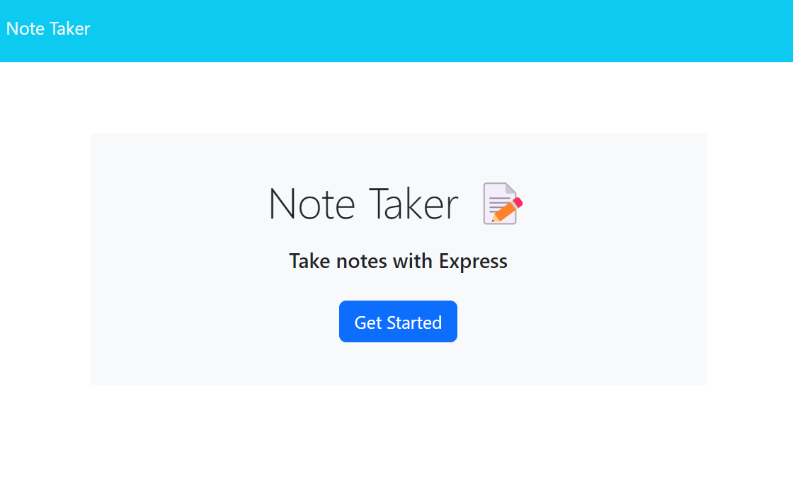
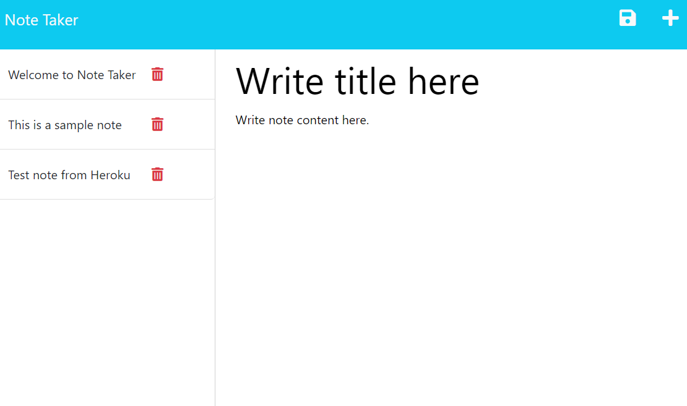

# Note-Taker-fullstack

## Description

This app is for reading, creating, and deleting notes. This app uses server and json database to so notes can be accessed from anywhere. Working on this project allowed me to practice creating server using express.js. This project also allowed me to practice deploying apps through [Heroku](https://dashboard.heroku.com/)

## Table of Contents

- [Note-Taker-fullstack](#note-taker-fullstack)
  - [Description](#description)
  - [Table of Contents](#table-of-contents)
  - [Installation](#installation)
  - [Usage](#usage)
  - [License](#license)
  - [Tests](#tests)
  - [Questions](#questions)

## Installation

No installation is required

## Usage

To access the deploied app, please go to the following Heroku URL: 
[https://note-taker-fullstack-4400582f9220.herokuapp.com/](https://note-taker-fullstack-4400582f9220.herokuapp.com/)

From the landing page, click the "Get Started" button to get to the note page. 

Typing in both "Note Title" and "Note Text"  will generate the save button  near  the top right. Clicking the save button next to the "+" button on the top right of the page will save the note and post it to the left side of the page. Clicking on the note will allow you to see the content of the note. Clicking the  "red trashcan"  button will deleted the corresponding note. When veiwing the content of the  existing note, clicking on the "+" button of the right will allow you to open up the note writting section to add more notes.

## License
  

## Tests

[Insomnia](https://insomnia.rest/) was used to test the routes during developement.

## Questions

For any questions, please visit my [GitHub profile](https://github.com/meekunn1).

For any additinal questions, please contact me through email at: meekunn@gmail.com